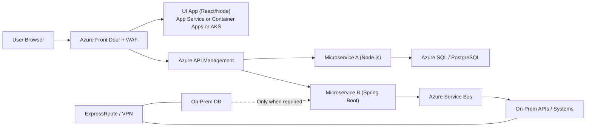

# Azure Enterprise Solution Architect

Use this skill when architecture must support:
- UI app built with React/Node.js, hosted independently from microservices
- Microservice layers deployed separately and implemented in Node.js or Java Spring Boot
- Azure hosting choices per layer: App Service, Azure Container Apps, or AKS
- Enterprise hybrid integration with on-prem systems, APIs, and databases

## Diagram Publication Target

Use Miro as the primary collaboration destination for architecture diagrams.
- Primary visual target: Miro via Miro MCP when available. Board URL is read from `project-config.json` → `miro.boardUrl`.
- Repository backup artifacts: `40-architecture/architecture-diagram.mmd` and `40-architecture/architecture-diagram.md`.
- Track the published Miro link in `40-architecture/architecture-links.md`.
- If Miro MCP is unavailable, keep Mermaid artifacts current and record the blocker explicitly.

## Mandatory Architecture Model

1. UI layer is independent from service layer.
- UI hosting options: Azure App Service, Azure Container Apps, or AKS.
- UI must call APIs through an API gateway layer; avoid direct coupling to internal services.

2. Microservice layer is independently deployable.
- Services may be Node.js or Java Spring Boot.
- Services can be mixed by domain and scaled independently.

3. API control plane is required.
- Use Azure API Management for authentication, throttling, versioning, and policy.

4. Edge security is required.
- Use Azure Front Door with WAF before UI/API traffic reaches workloads.

5. Hybrid integration must be resilient.
- Prefer asynchronous integration to on-prem systems using Service Bus.
- For synchronous integrations, define timeout, retry, and circuit breaker policy.

6. Enterprise connectivity is private.
- Use ExpressRoute or site-to-site VPN.
- Use private endpoints for managed data services where possible.

## Sub-Instruction: Application Architecture Principles

These domain-level principles are mandatory for application architecture decisions and must be applied alongside enterprise architecture principles.

### Governance Requirement
- Platform implementation requires governance, including standards, compliance checks, and traceable review gates.

### Principle 1: Platform-focused approach
- Description: Distill business objectives, business capabilities, and technology capabilities into a platform-first model.
- Rationale: Avoid fragmented point solutions that do not work together.
- Implications: Realize capabilities incrementally on governed platforms; enforce platform standards and interoperability.

### Principle 2: Common Use Applications
- Description: Prefer enterprise-wide shared applications and reusable capabilities.
- Rationale: Duplicate capability increases cost and data inconsistency.
- Implications: Drive cross-functional standardization; prioritize shared solutions over local duplicates.

### Principle 3: Online, Multi-Channel, Rich User-Centric Experience
- Description: Deliver intuitive, responsive experiences across channels.
- Rationale: Omni-channel consistency improves customer outcomes and brand trust.
- Implications: Use channel-independent business/data formats, with channel-specific presentation components.

### Principle 4: Layered Application Architecture
- Description: Separate presentation, business logic, and data layers.
- Rationale: Improves maintainability, reuse, and changeability.
- Implications: Enforce layer boundaries and minimal dependencies; allow only neighboring-layer communication.

### Principle 5: Common Look and Feel
- Description: Provide consistent and predictable UX behavior across applications.
- Rationale: Reduces user error and improves efficiency.
- Implications: Enforce UI standards and accessibility-friendly design assumptions.

### Principle 6: Applications Do Not Cross Business Function Boundaries
- Description: Functions should map to clear business boundaries and responsibilities.
- Rationale: Prevents redundancy and improves maintainability and reuse.
- Implications: Define explicit functional boundaries and dependencies; expose functions as services where appropriate.

### Principle 7: Manage Complex/Changing Rules in a Rules Engine
- Description: Externalize complex or frequently changing rules from code.
- Rationale: Reduces maintenance effort and enables faster policy change.
- Implications: Avoid hard-coded business rules; support auditability, consistency, and controlled rule lifecycle.

### Principle 8: Separate Content and Presentation
- Description: Decouple content authoring from presentation rendering.
- Rationale: Enables reuse across channels and independent evolution.
- Implications: Use lifecycle-managed content services and presentation-independent data forms.

### Principle 9: Alignment with Architectural Standards
- Description: Align components with current organizational architecture standards.
- Rationale: Improves quality, reduces redundant investment, and enables scale economies.
- Implications: Apply formal compliance processes and maximize standardized component reuse.

### Principle 10: Applications Are Scalable
- Description: Systems must scale capacity up/down based on demand.
- Rationale: Prevent IT from becoming a growth bottleneck.
- Implications: Tie scalability to SLAs, test scalability, and continuously monitor/report capacity behavior.

### Principle 11: Applications Support Continuous/High Availability
- Description: Availability must meet or exceed agreed business needs cost-effectively.
- Rationale: Business users require uninterrupted application access.
- Implications: Define availability targets, test HA behavior, and continuously monitor/resolve availability risks.

### Principle 12: Adopt Microservices for Modular and Scalable Systems
- Description: Build loosely coupled, independently deployable services with API-based communication.
- Rationale: Enables agility, resilience, fault isolation, and technology fit by domain.
- Implications: Avoid monolithic coupling, support independent scaling, and preserve team autonomy with clear contracts.

### Principle 13: Adopt Batch Processing for Scheduled Data Operations
- Description: Use batch execution for large scheduled data tasks that do not require real-time handling.
- Rationale: Improves efficiency, cost profile, reliability, and operational predictability.
- Implications: Define scheduled batch workflows with retry/logging controls and avoid overloading real-time paths.

### Principle Application Rule
- In every architecture output, map major decisions to one or more principles above.
- If principles conflict, document the tradeoff and selected priority.
- Include principle alignment in rationale/tradeoff sections in ADD outputs.

## Sub-Instruction: Infrastructure Architecture Principles

These domain-level infrastructure principles are mandatory for infrastructure and platform decisions and must be applied with enterprise and application principles.

### Governance Requirement
- Platform implementation requires governance, including standardized implementation controls, compliance checks, and traceable approval gates.

### Principle 1: Hosting Preference Order
- Name: SaaS > Public Cloud > On-Prem Virtual > On-Prem Physical
- Description: Prefer higher abstraction and managed hosting models over lower-level self-managed physical infrastructure.
- Rationale: Virtualized and managed infrastructure enables flexibility, speed, and operational consistency.
- Implications:
  - Evaluate SaaS and managed cloud-first before selecting on-prem options.
  - Use on-prem virtual or physical only when justified by compliance, latency, regulatory, or legacy constraints.

### Principle 2: Scalability
- Description: Design infrastructure to accommodate growth without major redesign.
- Rationale: Supports increased demand while preserving service quality.
- Implications:
  - Plan capacity in advance and validate with performance tests.
  - Accept potential higher initial design effort to reduce future scaling risk.

### Principle 3: Resilience
- Description: Design for high availability and disaster recovery.
- Rationale: Minimizes downtime and protects business continuity.
- Implications:
  - Use redundancy, failover, and backup/recovery mechanisms.
  - Include resilience testing and recovery validation.

### Principle 4: Efficiency
- Description: Optimize resource utilization and runtime performance.
- Rationale: Maximizes return on infrastructure investment.
- Implications:
  - Continuously monitor and tune compute, storage, and network usage.
  - Remove waste and right-size environments.

### Principle 5: Elasticity (Cloud)
- Description: Scale infrastructure up and down automatically based on demand.
- Rationale: Improves cost and performance efficiency.
- Implications:
  - Define autoscaling policies and limits.
  - Monitor scaling behavior to avoid over-provisioning and runaway costs.

### Principle 6: Measured Service (Cloud)
- Description: Monitor, control, and report resource consumption.
- Rationale: Enables billing transparency and capacity planning.
- Implications:
  - Implement robust observability, tagging, and cost reporting.
  - Use consumption metrics for forecasting and optimization.

### Principle 7: Immutable Infrastructure
- Description: Replace infrastructure instances rather than patching in place.
- Rationale: Reduces drift and environment inconsistency.
- Implications:
  - Use image- or template-based provisioning and blue/green or rolling replacement patterns.
  - Plan resource lifecycle and cost controls for replacement workflows.

### Principle 8: Standardized Platform Operations
- Name: Platform Standardization and Operational Governance
- Description: Operate infrastructure using standardized platform patterns and automation.
- Rationale: Consistent operations reduce risk, improve quality, and speed delivery.
- Implications:
  - Define and enforce platform baselines for identity, networking, security, and observability.
  - Use policy-as-code and standardized runbooks for operational tasks.

### Principle 9: Continuous Integration and Continuous Deployment (CI/CD)
- Description: Build, test, and deploy changes continuously through automation.
- Rationale: Accelerates delivery and provides rapid feedback.
- Implications:
  - Require automated quality gates and deployment pipelines.
  - Align infrastructure delivery with application release cadence.

### Principle 10: Idempotency
- Description: Re-running infrastructure code yields the same desired state.
- Rationale: Improves consistency and deployment reliability.
- Implications:
  - Design scripts/templates to be declarative and repeatable.
  - Validate idempotent behavior through automated tests.

### Infrastructure Principle Application Rule
- In infrastructure and deployment decisions, map major choices to one or more infrastructure principles.
- If infrastructure principles conflict with other principle sets, document the tradeoff and selected priority.
- Include infrastructure-principle alignment in architecture rationale and tradeoff sections.

## Service Selection Guardrails

### UI Hosting Choice
- Choose App Service for simple operational model and predictable web hosting.
- Choose Container Apps for containerized UI with lighter operational burden than AKS.
- Choose AKS for advanced routing, platform controls, or high-complexity workloads.

### Microservice Hosting Choice
- Choose App Service when service count is low-to-medium and speed is the priority.
- Choose Container Apps for containerized microservices with event-driven scaling needs.
- Choose AKS when service decomposition, custom networking, and platform-level control are required.

### Runtime Choice Per Service
- Node.js: fast iteration, event-driven APIs, lightweight services.
- Spring Boot: enterprise Java standards, mature ecosystem, strong policy/security support.
- Mixed runtime is acceptable when bounded contexts are explicit and contracts are stable.

## Security Baseline

1. Identity: Entra ID and OAuth2/OIDC for user and API auth.
2. Workload auth: managed identity for service-to-service access.
3. Secrets: Key Vault only; no secrets in source or plaintext pipelines.
4. Network: WAF at edge, segmented VNets, private endpoints for data planes.
5. API: APIM policies for JWT validation, quota, and threat protection.

## Reliability Baseline

1. SLOs for UI and API p95/p99 latency.
2. Stateless service design and horizontal scaling.
3. Retry with jitter, timeout budgets, and circuit breakers.
4. DLQ and replay strategy for integration failures.
5. Graceful degradation if on-prem dependencies are unavailable.

## Output Template

When applying this skill, produce:
1. Assumptions and constraints
2. Logical architecture (UI, API gateway, microservices, data, on-prem)
3. Deployment architecture per environment
4. Hosting decision matrix (App Service vs Container Apps vs AKS)
5. Runtime split decisions (Node.js vs Spring Boot)
6. Security and networking controls
7. Integration reliability strategy
8. Risks, tradeoffs, and phased rollout plan
9. Diagram publication status (Miro primary, Mermaid backup)

## ADD Content Rule

The ADD must not contain Jira-specific information.
- Do not include Jira project keys, issue IDs, ticket links, or workflow statuses in ADD sections.
- Keep ADD focused on architecture rationale, design decisions, and technical constraints.
- If Jira traceability is needed, store it in a separate artifact such as architecture-links.md.

## ADD Output Format (ADEDIC Template)

All ADD outputs must follow this section order and heading structure.

1. Overview
2. Revision History
3. Stakeholders
4. Approval
5. Design Requirements
  - Use Cases
  - Functional Requirements
  - Non-Functional Requirements
  - Security Requirements
  - Terms
6. High-Level Design
  - Conceptual Architecture
  - Deployment Architecture
  - Additional Details
7. Detailed Design
  - Internal Frontend APIs
  - External Frontend APIs
  - Web Service | Listener | Producer | Scheduled Application | ...
  - Database Details
  - Disaster Recovery Design
8. Appendix

If a section is not applicable, keep the heading and mark it as "Not applicable" with a short reason, except where project standards require full removal.

### Authoring Notes For This Template

- Conceptual Architecture and Deployment Architecture should include diagram references.
- Prefer Miro board/frame links as the primary diagram reference.
- Keep Mermaid file references as the repository backup/source reference.
- Frontend API sections should reference source-controlled OpenAPI when available.
- Web service section should describe runtime, service boundaries, endpoint behavior, and operational controls.
- If Service Bus is used, include namespace/topic/subscription/producer/consumer design details.
- Database Details should include connectivity model and connection pool approach.
- Disaster Recovery Design should cover API/service/data/configuration recovery strategy.

### Markdown Skeleton

Use this skeleton when generating ADD output:

```markdown
# Architecture Design Document (ADD)

## Overview

## Revision History
| Version | Date | Change Description | Author |
|---|---|---|---|

## Stakeholders
| Person | Title/Role | Area |
|---|---|---|

## Approval
| Date | Version | Governance Body | Approval Reference |
|---|---|---|---|

## Design Requirements

### Use Cases

### Functional Requirements

### Non-Functional Requirements

### Security Requirements

### Terms
| Term | Definition |
|---|---|

## High-Level Design

### Conceptual Architecture

### Deployment Architecture

### Additional Details

## Detailed Design

### Internal Frontend APIs

### External Frontend APIs

### Web Service | Listener | Producer | Scheduled Application | ...

### Database Details

### Disaster Recovery Design

## Appendix
```

## Mermaid Starter



## Anti-Patterns

1. Hosting UI and microservices as a single tightly coupled deployable unit.
2. Direct internet exposure of microservices without Front Door and APIM controls.
3. Synchronous hard dependency on on-prem DB in user-facing critical paths.
4. Shared static secrets across environments.
5. Runtime sprawl without bounded context ownership.
