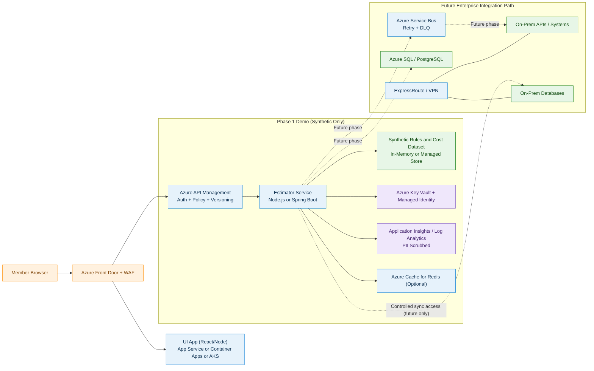

# Architecture Diagram

## Scope
- Product: Dental Procedure Cost Estimator
- Scope baseline: Cost estimator PRD and UX user flows
- Phase 1 constraints: synthetic data only, no PII persisted, no live enterprise API calls

## Diagram Source

## Notes
- UI hosting is independent from service hosting and can run on App Service, Container Apps, or AKS.
- Phase 1 estimate processing uses synthetic data only and does not call live enterprise dependencies.
- API ingress is governed by APIM, and internet edge is protected by Front Door plus WAF.
- Future enterprise integration path is explicit and clearly marked as future-phase only.
- Redis remains optional and should be introduced only if benchmark evidence supports it.
- Observability and secrets management are centralized through App Insights/Log Analytics and Key Vault with managed identity.
- Miro MCP publication is limited to generic diagram shapes, so Azure service icons must be added manually in Miro if exact iconography is required.
